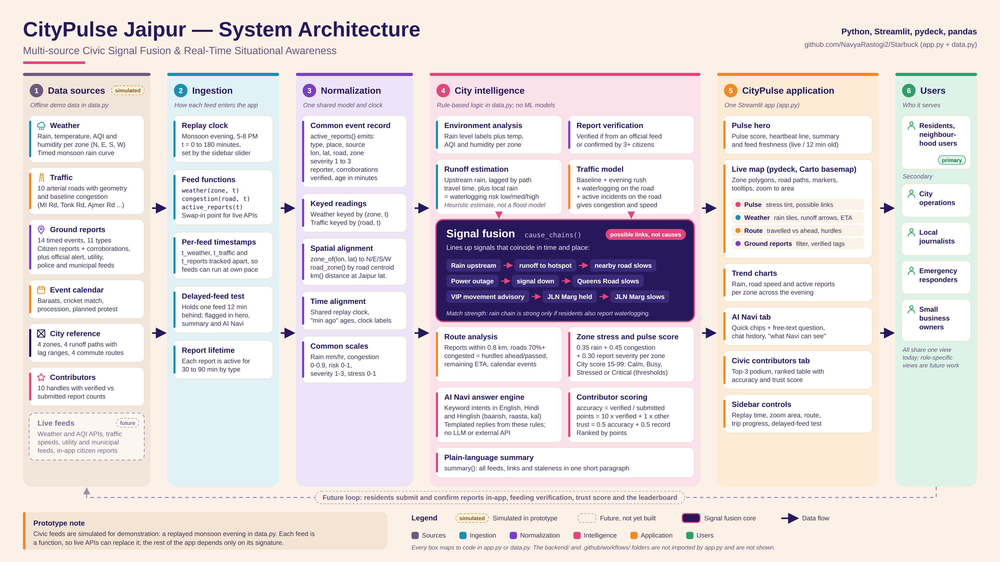

# CityPulse Jaipur

**One glance at how Jaipur is doing — weather, traffic and ground reports fused into a single, explainable city pulse.**

> Hackathon prototype. All civic data in this repository is **simulated** so the full demo runs offline.

---

## Problem

City information lives in disconnected places: rain alerts, traffic conditions, power outages, citizen complaints, police advisories. Each arrives in a different format and at a different time. As a result:

- There is **no single view** of how a neighbourhood is doing right now.
- Residents usually learn about a flooded underpass or a dead traffic signal **after** they are stuck in it.
- City staff struggle to **spot relationships** between events (rain → waterlogging → jams) because the signals sit in separate systems.

The hard part is not collecting one feed. It is combining several noisy, differently timed signals into something a non-technical person can understand quickly.

## Solution

CityPulse Jaipur brings three civic signals into one shared space-and-time model and turns them into a glanceable dashboard with plain-language explanations.

```text
Weather + Traffic + Ground Reports
              ↓
Common spatial context (4 zones, roads, routes) + common clock
              ↓
Signal fusion (zone stress, possible links between events)
              ↓
City Pulse score + map + plain-language summary + AI Navi
```

---

## Key Features

| Feature | What it does in the prototype |
|---|---|
| **Jaipur map, four zones** | Jaipur is split into North, East, South and West zones on an interactive pydeck map, with 10 major roads coloured by congestion. |
| **Pulse** | A city score (15–99) labelled *Calm / Busy / Stressed / Critical*, a heartbeat graphic whose intensity follows city stress, per-zone stress tinting and an auto-generated summary sentence. |
| **Weather** | Rainfall (mm/hr), temperature, AQI and humidity per zone, with rain labelled dry / light / moderate / heavy. |
| **Runoff & waterlogging estimates** | Four runoff paths (e.g. North → Johari Bazaar & Badi Chaupar) with estimated travel-time ranges, a low / medium / high waterlogging risk per hotspot, and roads to watch. *Prototype estimates, not flood prediction.* |
| **Route** | Four preset Jaipur routes. A progress slider splits the route into "travelled" and "still ahead", lists upcoming hurdles (reports and heavily congested roads near the route), and shows a rough ETA and average speed. |
| **Ground reports** | Active incidents with type, place, time since report, source, reporter handle, number of confirmations and a verified / unverified badge. Filterable by type. |
| **Possible links** | Surfaces events that line up in time and place (see below). Always labelled as *possible links, not confirmed causes*. |
| **Known in advance** | A small calendar of scheduled disruptions (wedding baraats, a cricket match, a procession, a planned protest) shown in Pulse and matched to your route. |
| **Time replay** | Replay a simulated monsoon evening from 5:00 PM to 8:00 PM in 5-minute steps; trend charts show rain, average road speed and active reports over time. |
| **Delayed-feed test** | Make any one feed 12 minutes old to see how stale data changes the picture; the UI and AI Navi flag the delay. |
| **AI Navi** | A chat assistant that answers questions about weather, routes, traffic, incidents, upcoming events and "why" questions, using only the current simulated feed state. |
| **Civic contributors** | A leaderboard of citizen reporters with points, accuracy, trust score and badges. |

### Incident types in the simulated scenario

Rain alert · Waterlogging · Power outage · Signal down · VIP movement · Baraat · Police naka · Road work · Accident · Tree fall · Stray cattle

### Possible links (signal fusion)

The prototype uses simple, transparent rules rather than a trained model:

- **Rain → Runoff → Slow road:** when a hotspot's waterlogging risk is high enough, CityPulse links upstream rain, the estimated runoff path and the slowest affected road. The link is marked *strong* if residents have also reported waterlogging there, otherwise *moderate*.
- **Power outage → Signal down → Slow road:** shown when an outage and a signal failure are both active.
- **VIP movement → Road held → Slow road:** shown when an official VIP advisory is active.

---

## How It Works

```text
data.py  (simulated feeds, one scripted monsoon evening)
  ├─ Weather: rain per zone over time → temp, AQI, humidity
  ├─ Traffic: road congestion = baseline + evening rush + waterlogging + incidents
  └─ Ground reports: 14 timed citizen / official reports
              ↓
Spatial + temporal alignment
  (zones, road geometry, distance-to-route, report lifetimes, replay clock)
              ↓
Fusion
  ├─ zone stress  = rain (35%) + congestion (45%) + report severity (30%)
  ├─ city pulse   = average zone stress → score and label
  ├─ possible links (rule-based)
  └─ plain-language summary
              ↓
app.py  (Streamlit UI)
  Live map: Pulse / Weather / Route / Ground reports
  AI Navi (rule-based Q&A) · Civic contributors leaderboard
```

Traffic reacts to the other two feeds: waterlogging risk and nearby incidents slow down roads, which in turn raise zone stress and the route ETA.

---

## System Architecture



---

## Technology Stack

| Layer | Technology |
|---|---|
| Language | Python |
| UI / app framework | Streamlit |
| Map | pydeck (deck.gl), CARTO light basemap |
| Data handling / charts | pandas + Streamlit charts |
| Data | Simulated, generated in Python (`math` only; no database) |

No external APIs, databases, machine-learning models or LLMs are used in the current code.

---

## Data Sources

**All data is simulated.** `data.py` scripts one monsoon evening in Jaipur (5:00–8:00 PM):

- **Weather:** rain rises and falls in each zone at different times (starting over the northern hills); temperature, AQI and humidity are derived from rainfall.
- **Traffic:** 10 named roads (MI Road, Tonk Road, JLN Marg, Ajmer Road, etc.) with baseline congestion that responds to the evening rush, waterlogging and incidents.
- **Ground reports:** 14 timed reports. Some are attributed to citizens (with a handle and a confirmation count) and some to *simulated* official sources such as a weather alert feed, utility outage feed, traffic police advisory and municipal works feed.

Each feed is produced by a plain Python function. The rest of the app only depends on those function signatures, so a generator can later be replaced with a live API without rewriting the UI.

---

## AI Navi

AI Navi lives in its own tab. You can tap a quick question (*Weather*, *My route*, *Incidents*, *Why is it slow?*) or type your own.

**How it works:** Navi is a **rule-based, keyword-matching assistant** written in Python (`answer()` in `data.py`). It does not call an LLM or any external AI API. It:

- detects topics (weather, route, traffic, incidents, upcoming events, "why") and zone names in the question;
- understands a few Hindi / Hinglish words such as *baarish*, *raasta*, *jam*, *kal* and *kyun*;
- builds its answer only from the current simulated feed state at the selected replay time;
- labels connections as possible links, flags unverified reports, and mentions when a feed is delayed.

Conversation history is kept in the Streamlit session and can be cleared.

---

## Civic Contributor System

The **Civic contributors** tab shows a sample leaderboard of 10 contributor handles (no real names).

- **Verification (ground reports):** a report is shown as *verified* if it comes from an official source or has been confirmed by at least 3 people.
- **Leaderboard (sample data):** for each contributor the app computes accuracy (verified ÷ submitted), points and a trust score (a mix of accuracy and number of verified reports), then shows a top-3 podium, a sortable table, badges and an area filter.

Submitting new reports, confirming others' reports and user accounts are **not** implemented; contributor data is hard-coded for the demo.

---

## Project Structure

```text
Starbuck/
├── .github/workflows/        # GitHub Actions workflow(s)
├── backend/                  # Backend folder
├── architecture.png          # System architecture diagram
├── app.py                    # Streamlit UI: sidebar controls, map modes, AI Navi, leaderboard
├── data.py                   # Simulated feeds, fusion logic, pulse score, AI Navi answers, leaderboard
├── citypulse-jaipur.zip      # Archived earlier build
├── citypulse-jaipur-v3.zip   # Archived earlier build
└── README.md
```

The running app is entirely `app.py` + `data.py`: `app.py` handles only presentation and imports all data and logic from `data.py`.

---

## Running Locally

Requires Python 3 and a recent version of Streamlit.

```bash
git clone https://github.com/NavyaRastogi2/Starbuck.git
cd Starbuck

python -m venv .venv
source .venv/bin/activate        # Windows: .venv\Scripts\activate

pip install streamlit pydeck pandas
streamlit run app.py
```

Streamlit will open the app in your browser (usually at `http://localhost:8501`). An internet connection is needed for the map tiles and web fonts; the civic data itself is fully offline.

### Try this in the demo

1. Drag **Replay the evening** from 5:00 PM towards 7:00 PM and watch rain move from North Jaipur and waterlogging reports appear.
2. Switch to **Weather** to see runoff paths and estimated travel times.
3. Pick a route in **Route** and move the trip progress slider.
4. Set **Test a delayed feed** to *Traffic* and see how the summary changes.
5. Ask AI Navi: *"Why is traffic slow?"* or *"Tonk Road pe baarish ka kya haal hai?"*

---

## Demo / Screenshots

<!-- TODO: Add screenshots to the repo (e.g. docs/screenshots/) and link them here. -->

| Pulse | Weather | Route |
|---|---|---|
| *screenshot coming soon* | *screenshot coming soon* | *screenshot coming soon* |

| Ground reports | AI Navi | Civic contributors |
|---|---|---|
| *screenshot coming soon* | *screenshot coming soon* | *screenshot coming soon* |

---

## Current Limitations

- **All data is simulated.** One scripted evening, fixed road geometry, 14 scripted reports and 10 sample contributors. The "live" labels in the UI refer to the simulated feeds.
- **Runoff and waterlogging are rough estimates** based on a simple rainfall-and-lag formula, not hydrological modelling or professional flood prediction.
- **Possible links are rule-based correlations,** not proven causes, and only three link patterns are defined.
- **Zones are simplified** as four triangles around the city centre, not administrative wards.
- **Routes are fixed presets;** ETA is a rough average of nearby road speeds, not real routing.
- **AI Navi is keyword-based,** so unusual phrasing may fall back to a general summary.
- **No report submission, user accounts or persistence;** the leaderboard is sample data.

---

## Future Scope

Possible **future integrations** (not implemented today):

- Live weather, rainfall and air-quality APIs
- Live traffic and public-transit feeds
- Citizen reporting (in-app submission and confirmation) and 311 / municipal complaint systems
- Utility outage feeds and emergency alerts
- Real drainage / elevation data for better waterlogging estimates
- Optional LLM-backed AI Navi grounded on the same feed data
- Ward-level zones and real routing

---

## Team Contributions

| Team Member | GitHub | Contribution |
|---|---|---|
| **Navya Rastogi** | [@NavyaRastogi2](https://github.com/NavyaRastogi2) | Frontend & backend development, application implementation, core functionality |
| **Navya Sharma** | [@nvyshrm8](https://github.com/nvyshrm8) | Presentation, architecture diagram, documentation, demo preparation |

Both team members contributed to the overall product development and hackathon submission.

Built for **AmiHacks** (Track B: live civic health dashboard).

---

## License

No license has been added to this repository yet.
